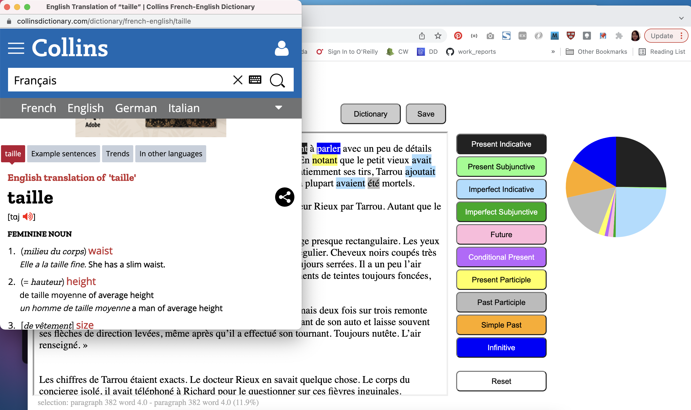
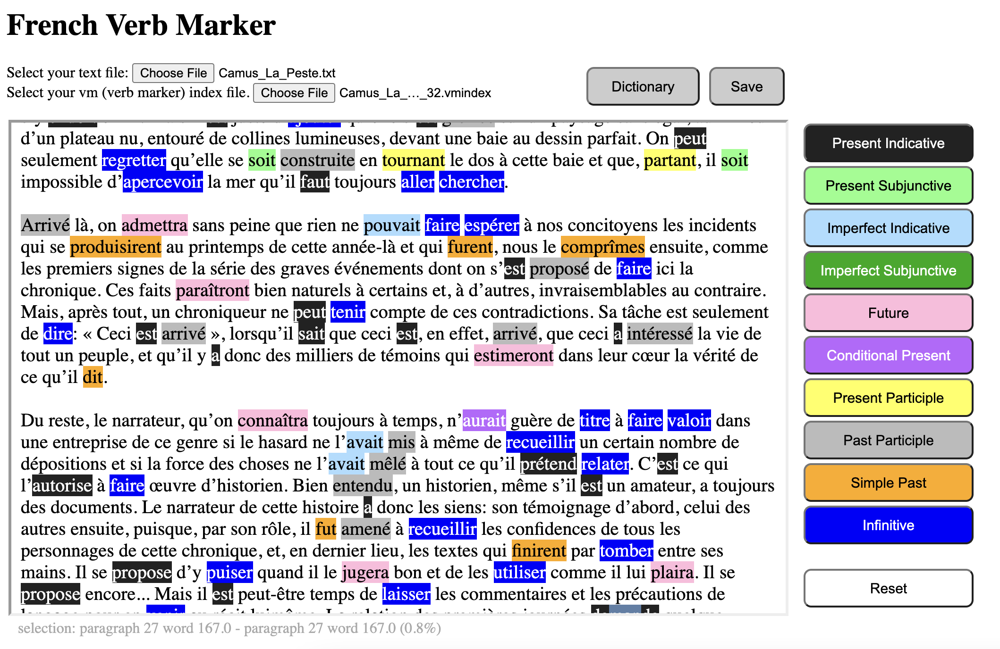
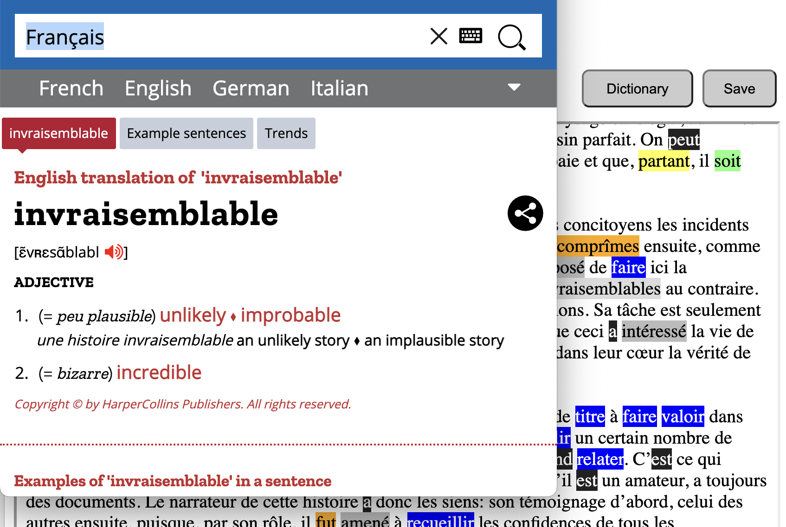

# FrenchVerbMarker
* A web page that allows the user to mark French verbs according to their tense / mood. Mostly written in Javascript inside an html file.

## Disclaimer
I wrote this to aid my own French learning in Jan 2022 and I have been using it for seven months consistently so far. I understand most people would not use this kind of learning approach, but it works for me and I'm sharing this code not to open a discussion about how best to learn French, but for those who think it may benefit them. 

## Example screen shot

## How to use it

Just open the `index.html` file using your Web browser. I only tested it on Chrome.

Then, open a text file and mark verbs by selecting each verb and pressing one of the buttons on the right side. This is purely for practicing purpose and it's up to the user to find the correct answer (the app does not provide a correct answer).

### Saving the progress
The user can save the current marks by clicking 'Save' to save it into a vm index file. It will most likely be saved in your `Downloads` folder. You can reuse the existing vm index next time by opening it as the vm index file. This way you can start from where you left off last time. Every time you press the 'Save' button, it saves it into a new vm index file, with the file name containing the time stamp.

### Dictionary
The dictionary button is useful for learning new words. Simply select any text and press the dictionary button. Mostly the selection would be a word but can be multiple words or a part of a word as long as it is in the dictionary.

## Glitches / limitations
* To load another text (or the same text again), opening a new text file would not work because it will add to the end of the current text. Refresh the page by using Ctrl-R instead and start over. Make sure to save what you have before refreshing.
* It requires the internect connection because it is used for drawing the piechart whih keeps track of the verb type frequency.
* If you modify the text outside the app, your previously saved vm index files may no longer work.
* The text's main special characters that come with a word, including `.`, `,`, `?`, `!`, `"`, `'`, `-`, `:`, `;` etc. should be the standard ASCII characters and should not be something non-standard (e.g. `“` instead of `"`). Otherwise the word definition (see below) would not work properly. However, if any special character is isolated by space or not attached to a word, it should be fine. For example, the `«` or `»` character in `dire: « Ceci est arrivé », lorsqu'il` does not cause any issue. But it would in `«Ceci est arrivé»` since there `»` is attached to a word `arrivé` (and `«` to `Ceci`). This way you won't be able to select just `arrivé` but will be forced to select `arrivé»` as a verb, because the app does not recognize the character `»` as a meaningful special character.

## Unit of marking
* For convenience, a 'word,' as the unit of marking, does not contain any special character. For example, you cannot mark `J'ai` but only the `ai` part. In `Qu'est-ce`, only the `est` part can be marked and not the whole thing. If you select past the boundary of a word, the marker would not work. For example, `peut-être` may exist in the dictionary as a single word, but you won't be able to mark the whole thing as a verb (of course it is also not a verb).
* You may think `avait vu` for example must be marked as a single tense **pluperfect**. With this app, you would mark `avait` as **imperfect indicative** and `vu` as **past participle**.
* There is no **imperative** in the menu, since it is mostly the same as the **present indicative**.

## Size of input
* I tested it with a 500kb text file and it worked fine on my Macbook computer.
